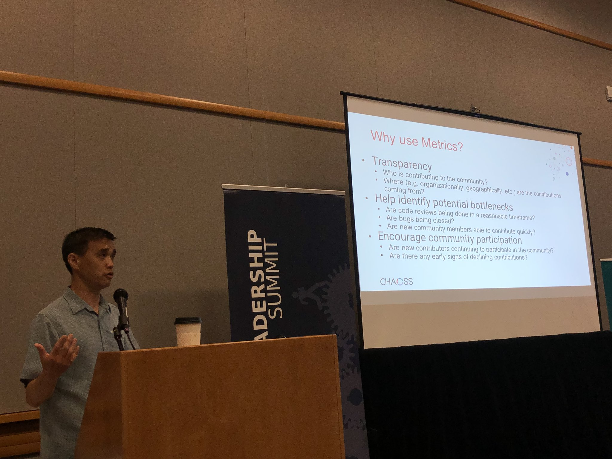

# CHAOSS at Community Leadership Summit 2018

The CHAOSS project aims to develop metrics and software for measuring open source projects. One group of people that care about this are community managers. Every year, Jono Bacon, a CHAOSS Governing Board member who professionalized community management with his book “The Art of Community”, invites community managers to his Community Leadership Summit. (In his book, Jono dedicated the entire chapter 7 to measuring communities.)Judging by the reactions on Twitter and engagement with other conference participants, metrics was a popular topic at the conference. It is no surprise, that members of the CHAOSS project would naturally be at this conference. This blog post summarizes the presence of CHAOSS at the Community Leadership Summit and highlights some takeaways and insights.

*Ray Paik giving his keynote on metrics at the Community Leadership Summit 2018. Picture used with permission from @ShillaSaebi.*

Ray Paik, a long-time CHAOSS member, gave a keynote titled “looking beyond the numbers”. He addressed why we use metrics, what pitfalls and flaws metrics have, and dos and don’ts of community metrics. Slides are available online.

The CHAOSS Diversity and Inclusion workgroup, specifically Emma Irwin, Sean Goggins, Nicole Huesman, Daniel Izquierdo Cortazar, and Anita Sarma, organized a panel session on the topic of “Establishing Metrics that Matter for Diversity & Inclusion”. Questions discussed during the panel included: How can we safely collect open source project metrics without jeopardizing minority groups and their safety? What metrics can we have about the inclusiveness of software design? What are leadership challenges related to diversity and inclusion and how can metrics help? A major takeaway is that when we create metrics and collect data, we should remember to talk to people who actually face the challenges and not just “professionals or researchers” who may only know somethings about the issues and not the complete picture since they do not face these issues.

“Shaping Inclusive Meritocracy: What do you measure? What do you do?” was the title of an unconference session initiated by Sean Goggins, a CHAOSS Governing Board member. The session drew a good group of people who vividly engaged in conversations and exchanged ideas.

We welcome any and all who learned about CHAOSS during this weekend to join our weekly calls and provide feedback on our metrics and software. The CHAOSS community aims to be useful to community managers, thus we rely on your feedback.

Blogpost written by Georg Link with help from the CHAOSS community.
